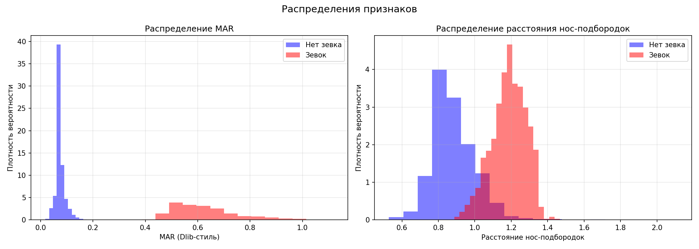
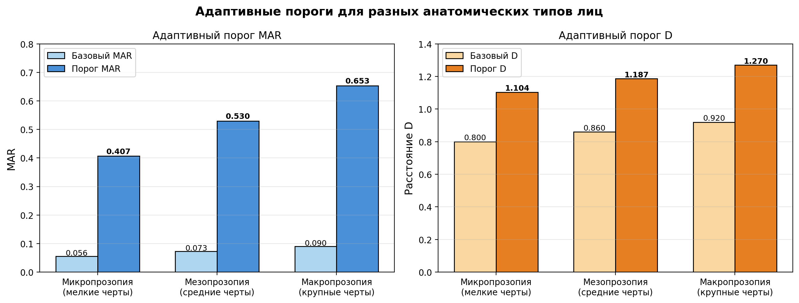
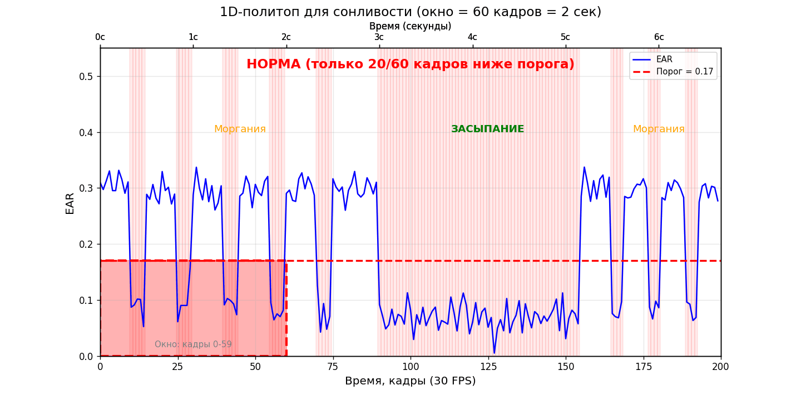
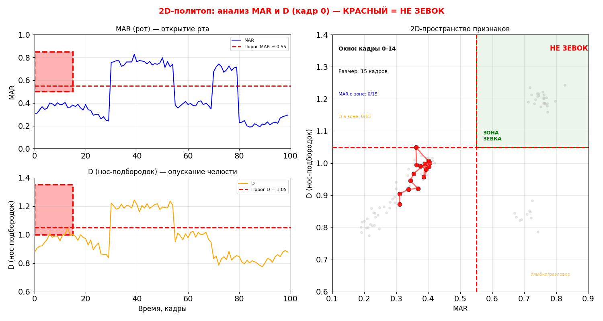
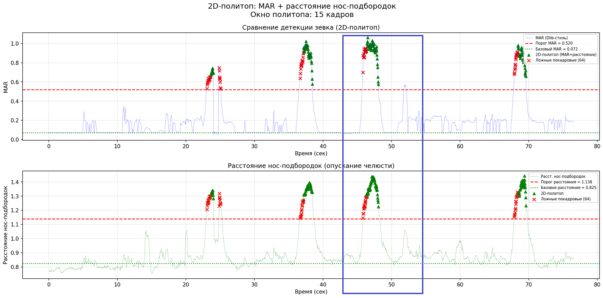

# Научно-исследовательская часть:

# «Система мониторинга состояния водителя на основе адаптивного порогового анализа и политопной фильтрации видеоданных»

**Автор:** Волкова Н.В.

**Роль в проекте:** научное обоснование выбора геометрических признаков, статистический анализ, расчет коэффициентов адаптивного порога, экспериментальное сравнение политопных методов детекции.

## 1. Цель исследования

Обосновать выбор геометрических признаков лица (MAR и нормализованное расстояние «нос-подбородок») для детекции зевка, рассчитать универсальные коэффициенты адаптивного порога, экспериментально подтвердить эффективность политопного подхода к фильтрации ложных срабатываний.

## 2. Датасет и методология

### 2.1. Исходные данные

- **Источник:** датасет YawDD (Yawning Detection Dataset) — 29 видеофайлов с фронтальной съёмкой лиц водителей в салоне автомобиля.
- **Извлечение кадров:** автоматизированный конвейер с шагом 3 кадра (каждый третий).
- **Объем выборки:** 6998 изображений (1295 — зевок, 5703 — не зевок).

### 2.2. Классификация кадров (автоматическая, без ручной разметки)

| Класс | Условия |
|:---|:---|
| **Зевок (yawn)** | MAR ≥ 0.60 (широко открытый рот) |
| **Не зевок (no_yawn)** | 0.025 ≤ MAR ≤ 0.040 (рот закрыт) И EAR > 0.20 (глаза открыты) |

### 2.3. Геометрические признаки

**MAR (Mouth Aspect Ratio)** — модифицированная формула в стиле Dlib с тремя вертикальными замерами:

MAR = (|P80-P82| + |P13-P14| + |P312-P317|) / (3 * |P78-P308|)

**Расстояние «нос-подбородок» (D)** — нормализованное на ширину лица:

D = |P1 - P152| / |P33 - P263|

Индексы точек соответствуют разметке MediaPipe Face Mesh (468 точек).

## 3. Результаты статистического анализа

### 3.1. Описательные статистики

| Признак | Класс | Среднее ± ст.откл. | Медиана | 25-й перцентиль |
|:---|:---|:---|:---|:---|
| MAR | Зевок | 0.621 ± 0.134 | 0.621 | 0.528 |
| MAR | Не зевок | 0.075 ± 0.018 | 0.073 | — |
| D | Зевок | 1.186 ± 0.094 | 1.193 | — |
| D | Не зевок | 0.883 ± 0.119 | 0.862 | — |

### 3.2. Проверка статистической значимости (U-критерий Манна-Уитни)

| Признак | U-статистика | p-value | Cohen's d | Интерпретация |
|:---|:---|:---|:---|:---|
| MAR | 7 367 774 | < 0.001 | -0.997 | Большой эффект |
| D | 7 157 955 | < 0.001 | -0.940 | Большой эффект |

**Вывод:** оба признака статистически значимо различаются между классами «зевок» и «не зевок» (p < 0.001). Размер эффекта Cohen's d > 0.8 соответствует большой практической значимости.

### 3.3. Распределение признаков

Гистограммы показывают, что распределения значений MAR и D для классов «зевок» и «не зевок» практически не пересекаются.

<div align="center">
  <a href="images/statistical_distributions.png">
    
  </a>
</div>

### 4. Коэффициенты адаптивного порога

| Коэффициент | Значение | Формула | Исходные данные |
|:---|:---|:---|:---|
| **K_MAR** | 7.26 | P₂₅(MAR_yawn) / Med(MAR_no_yawn) | 0.528 / 0.073 |
| **K_nose_chin** | 1.38 | Med(D_yawn) / Med(D_no_yawn) | 1.193 / 0.862 |
| **K_EAR** | 0.6 | Фиксированный (Soukupová & Čech, 2016) | Литературные данные |

**Применение в MVP:** индивидуальный порог для каждого водителя рассчитывается как:

Порог_водителя = Базовый_уровень_водителя × K, 

где базовый уровень измеряется в ходе 30-секундной калибровки.

## 4.1. Адаптивные пороги для разных типов лиц

График демонстрирует, как система подстраивается под анатомию конкретного водителя. Чем крупнее черты лица, тем выше индивидуальный порог.

<div align="center">
  <a href="images/adaptive_thresholds_fixed.png">
    
  </a>
</div>

## 5. Экспериментальное сравнение методов детекции зевка

## 5.1. 1D-политоп (сонливость, отвлечение, наклон)

**Принцип работы:** 1D-политоп анализирует один признак. Событие фиксируется только если условие выполняется для всех кадров в скользящем окне (60 кадров = 2 секунды).

<p align="center">  </p>

На GIF показана работа 1D-политопа для детекции сонливости по EAR. Окно 60 кадров движется по сигналу. Когда все 60 кадров ниже порога — окно становится зелёным, и система фиксирует засыпание. Короткие моргания (0.1–0.4 секунды) не приводят к срабатыванию.

## 5.2. 2D-политоп (зевок: MAR + D)

**Принцип работы:**  2D-политоп анализирует два признака одновременно — MAR (открытость рта) и D (опускание челюсти). Зевок фиксируется только когда оба признака превышают пороги для всех 15 кадров окна (0.5 секунды).

<p align="center">  </p>

На GIF показана синхронная работа 2D-политопа. Слева — два временных ряда (MAR и D), справа — пространство признаков. Зевок фиксируется только когда все 15 точек окна попадают в правый верхний квадрант (зелёная зона).

## 5.3. Демонстрация на реальном видео

На графике показан временной ряд MAR и D для фрагмента видео 8-FemaleGlasses.avi. Прямоугольником выделен участок, где оба признака превышают пороги — это зевок и участок, где MAR высокий, но D остаётся ниже порога — это разговор или улыбка, которые не должны классифицироваться как зевок.

<div align="center"> <a href="images/2D_graph.png">  </a> </div>

На GIF ниже показана синхронная работа 2D-политопа на том же фрагменте. 

<div align="center"> <a href="images/video_demo.gif">  </a> </div>

На анимации видно, как система отличает зевок от улыбки: при зевке рамка становится красной, при улыбке/разговорое — оранжевой. Это подтверждает, что добавление второго признака — расстояния нос-подбородок — позволяет отсечь ложные срабатывания, связанные с открытием рта без опускания челюсти.

### 5.4. 1D-политоп (только MAR) — пакетная обработка (22 видео)

**Эксперимент:** на 22 видео из датасета YawDD выполнено сравнение покадрового метода (событие фиксируется при превышении порога MAR в единичном кадре) и 1D-политопа (событие фиксируется только если MAR ≥ порога для всех 15 кадров окна). Индивидуальные пороги рассчитаны по формуле Порог = MAR_базовый × 7.26.

| Метрика | Покадровый | 1D-политоп | Изменение |
|:---|:---|:---|:---|
| Всего событий | 74 | 40 | — |
| Ложных событий | 34 | — | — |
| Общее снижение | — | — | **45.9%** |
| Среднее снижение по видео | — | — | **28.7%** |
| Медианное снижение | — | — | **16.7%** |

**Вывод:** политопный подход на уровне событий демонстрирует снижение ложных срабатываний на 45.9% (общее) и 28.7% (среднее по видео). На 12 видео снижение составило 0% — это видео, на которых все покадровые события были достаточно длительными (превышали размер окна политопа). Метрика на уровне событий исключает артефакты на границах зевка, где покадровый метод срабатывает раньше, чем заполняется окно политопа.

### 5.2. 2D-политоп (MAR + расстояние) — пакетная обработка (22 видео)

**Эксперимент:** 2D-политоп анализирует два признака одновременно — MAR (открытость рта) и нормализованное расстояние «нос-подбородок» (опускание челюсти). Зевок фиксируется, если оба параметра превышают индивидуальные пороги для всех 15 кадров окна. Добавление второго измерения позволяет отличить истинный зевок от улыбки или разговора (рот открыт, но челюсть не опущена).

| Метрика | Покадровый | 2D-политоп | Изменение |
|:---|:---|:---|:---|
| Всего событий | 63 | 25 | — |
| Ложных событий | 38 | — | — |
| Общее снижение | — | — | **60.3%** |
| Среднее снижение по видео | — | — | **39.4%** |
| Медианное снижение | — | — | **41.7%** |

**Вывод:** 2D-политоп обеспечил снижение ложных событий на 60.3% (общее) и 39.4% (среднее по видео). На трёх видео (12-FemaleGlasses, 13-FemaleGlasses, 16-MaleNoGlasses) достигнуто 100% снижение — все покадровые срабатывания были отфильтрованы, так как высокий MAR не сопровождался опусканием челюсти.

### 5.3. Сравнение 1D и 2D политопов

| Метрика | 1D (только MAR) | 2D (MAR + D) | Улучшение |
|:---|:---|:---|:---|
| Покадровых событий | 74 | 63 | -11 (-14.9%) |
| Политопных событий | 40 | 25 | -15 (-37.5%) |
| Среднее снижение | 28.7% | 39.4% | **+10.7 п.п.** |
| Медианное снижение | 16.7% | 41.7% | **+25.0 п.п.** |

**Вывод:** 2D-политоп превосходит 1D-политоп по специфичности. Добавление расстояния «нос-подбородок» позволило отсечь 11 событий уже на покадровом уровне (14.9%) — это события, в которых MAR был высоким (рот открыт), но челюсть не была опущена (улыбка, разговор). Среднее снижение ложных событий выросло с 28.7% до 39.4%, медианное — наиболее значительно, с 16.7% до 41.7%.

### 5.4. Детекция сонливости, отвлечения и наклона головы (22 видео)

**Эксперимент:** три независимые системы детекции, использующие 1D-политоп с окном 60 кадров (2 секунды). Сонливость детектируется по EAR с адаптивным порогом (EAR < EAR_базовый × 0.6), отвлечение — по |yaw| > 30°, наклон головы — по |roll| > 20°. Пороги yaw и roll являются фиксированными, так как не зависят от индивидуальной анатомии водителя.

| Система | Покадровых | Политопных | Снижение (общее) | Снижение (среднее) |
|:---|:---|:---|:---|:---|
| Сонливость (EAR < порог) | 945 | 12 | **98.7%** | **94.3%** |
| Отвлечение (\|yaw\| > 30°) | 444 | 33 | **92.6%** | **81.1%** |
| Наклон головы (\|roll\| > 20°) | 312 | 2 | **99.4%** | **81.1%** |

**Вывод:** политопный подход эффективно фильтрует кратковременные естественные движения. Из 945 покадровых событий сонливости (моргания, закрытие глаз при зевке) подтверждены только 12 как длительное закрытие глаз (>2 секунд). Из 444 покадровых событий отвлечения подтверждены 33 длительных поворота головы. Из 312 покадровых событий наклона подтверждены только 2. Наибольшее количество подтвержденных событий сонливости — на видео 8-FemaleGlasses.avi (4 события).

## 6. Ограничения исследования и этический аспект

### 6.1. Лицензионные ограничения YawDD

Датасет используется только для **некоммерческих исследовательских целей** с обязательным цитированием. Для иллюстрации метрик лица используется изображение участника **Female #1**, имеющего явное разрешение на публикацию:

| Параметр | Значение |
|:---|:---|
| Участник | Female #1 |
| Mouth Position | Normal-Talking-Yawning |
| Ethnicity | Middle Eastern |
| Разрешение на фото | **Да** |

### 6.2.  Этническая репрезентативность

Датасет YawDD не является репрезентативным для многонационального населения РФ. Для минимизации bias используются непараметрические методы (U-тест, медианы), а адаптивная калибровка в конечной системе компенсирует индивидуальные анатомические различия.


### 6.3. Хранение данных

В процессе исследования извлеченные геометрические признаки сохраняются в CSV для статистического анализа. Исходные изображения датасета не сохраняются и не публикуются.

### 6.4. Выявленные технические ограничения

В ходе экспериментальной работы выявлены следующие ограничения используемых методов:

| Ограничение | Описание | Влияние на результаты |
|:---|:---|:---|
| **Нестабильность оценки угла pitch** | Метод solvePnP на монокулярном изображении выдаёт значения pitch, стремящиеся к ±180° при заведомо нейтральном положении головы. Ошибка определения pitch в 1.5–2 раза превышает ошибку yaw и roll | Угол pitch исключён из состава анализируемых признаков в итоговой конфигурации. Для детекции отвлечения и наклона используются только yaw и roll |
| **Чувствительность к освещению** | MediaPipe Face Mesh работает корректно при естественном освещении, но при экстремально низкой освещенности (ночные условия) точность детекции ключевых точек снижается | В текущем исследовании использовались видео с дневной съемкой. Для ночных условий требуется ИК-камера |
| **Ракурс съемки** | Система требует фронтального расположения лица в кадре. При повороте головы более чем на 45° детекция ключевых точек становится нестабильной | В датасете YawDD все видео сняты с фронтальной камеры. Для реальных систем требуется отслеживание лица и временное отключение детекции при экстремальных ракурсах |
| **Очки и маски** | MediaPipe корректно работает с очками, но медицинские маски, закрывающие рот, делают невозможным расчет MAR и расстояния «нос-подбородок» | Для масок детекция зевка становится невозможной. Система должна фиксировать этот факт и использовать другие признаки (сонливость по EAR) |

## 6.5. Этический аспект
MAR, D, EAR — биометрические данные (ФЗ-152). Хранятся только агрегированные данные, исходные изображения не сохраняются.

---

## 7. Передача результатов в инженерный модуль

| Результат | Значение | Формат |
|:---|:---|:---|
| K_MAR | 7.26 | `scientific_coefficients.json` |
| K_nose_chin | 1.38 | `scientific_coefficients.json` |
| K_EAR | 0.6 | литература |
| Окно зевка | 15 кадров (0.5 с) | ТЗ |
| Окно сонливости/отвлечения/наклона | 60 кадров (2.0 с) | ТЗ |
| Порог yaw | 30° | ТЗ |
| Порог roll | 20° | ТЗ |
| Pitch | исключён | не используется |


## 8. Структура ноутбуков

| № | Файл | Содержание |
|:---|:---|:---|
| 01 | `dataset_preparation.ipynb` | Извлечение кадров из YawDD |
| 02 | `scientific_analysis.ipynb` | Статистика, расчет K |
| 03-04 | `1d_polytope_*.ipynb` | 1D-политоп (одно и 22 видео) |
| 05-06 | `2d_polytope_*.ipynb` | 2D-политоп (одно и 22 видео) |
| 07 | `distraction_drowsiness.ipynb` | Отвлечение, наклон, сонливость |
| 08 | `4systems_single.ipynb` | Совместная работа 4 систем |
| 09 | `deq_perclos_prediction.ipynb` | DEQ-концепция (перспектива) |

**Примечание:** ML-верификация (кросс-валидация) выполнена как валидационное исследование и не включена в финальную реализацию MVP. Подробности вынесены в отдельный файл ML_VERIFICATION.md.

## 9. Выходные данные для инженерной реализации

Файл `scientific_results_YawnDD/scientific_coefficients.json`:
<pre>
```json
{
  "coefficients": {
    "K_mar": {
      "value": 7.26,
      "yawn_value": 0.528,
      "no_yawn_median": 0.073,
      "mvp_formula": "Порог_водителя = mar_калибровки * 7.26"
    },
    "K_nose_chin_distance": {
      "value": 1.38,
      "yawn_value": 1.193,
      "no_yawn_median": 0.862,
      "mvp_formula": "Порог_водителя = nose_chin_distance_калибровки * 1.38"
    }
  },
  "K_EAR": {
    "value": 0.6,
    "source": "Soukupova & Cech (2016)"
  }
}
</pre>
---

**Дата:** 2026-06-05
**Автор:** Волкова Н.В.
